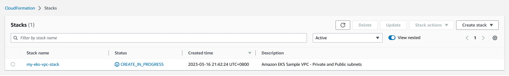
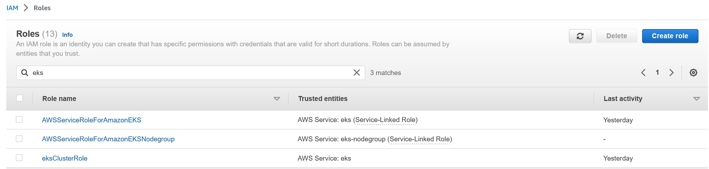
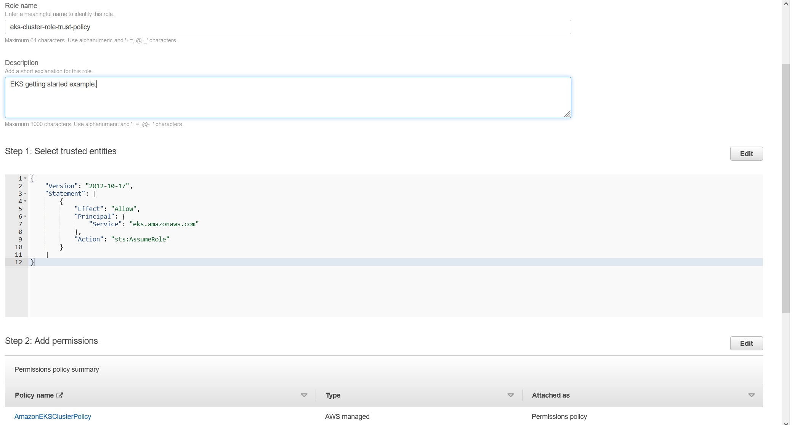

## 手動建立 AWS EKS service


在使用 Terraform 建立以前，先熟悉手動方式會比較合適。 我這邊參考 AWS 官方文件 [Getting started with Amazon EKS – AWS Management Console and AWS CLI](https://docs.aws.amazon.com/eks/latest/userguide/getting-started-console.html#eks-launch-workers)


1. 使用 `aws` CLI 工具建立 EKS 需要的 VPC，其中 `--region` 與 `--stack-name` 請自行更換。
註: 不想安裝 `aws` CLI tool 的話也能從網頁點啦~

```bash
aws cloudformation create-stack \
  --region ap-southeast-1 \
  --stack-name my-eks-vpc-stack \
  --template-url https://s3.us-west-2.amazonaws.com/amazon-eks/cloudformation/2020-10-29/amazon-eks-vpc-private-subnets.yaml
```


▲ 關於 EKS 使用的 VPC 搭配架構圖會比較好理解。圖片來源 [aws-quickstart / quickstart-amazon-eks ](https://github.com/aws-quickstart/quickstart-amazon-eks)




▲ CloudFomation stack 建立中




▲ 建議把這三個 AWS managed 的 role 都先拉出來

> - AWSServiceRoleForAmazonEKS：此 IAM role 是 Amazon EKS 服務的服務角色，可以用來控制 Amazon EKS 服務管理的 AWS 資源和 API 操作的權限。此角色是由 Amazon EKS 管理的，您不需要自己創建。
> - AWSServiceRoleForAmazonEKSNodegroup：此 IAM role 是用來授予 Amazon EKS worker node 的權限，以便它們能夠與 Amazon EKS API 進行通訊。當您向 Amazon EKS 中添加新的 worker node 時，可以指定此角色作為 worker node 的 IAM role。
> - eksClusterRole：此 IAM role 可以用來管理 Amazon EKS 群集。您可以使用此 IAM role 來設置群集的叢集層級 IAM 權限。此角色不是由 Amazon EKS 管理的，您需要自己創建此 IAM role。例如，您可以使用此 IAM role 設定叢集的存取控制原則，以便只有授權的使用者才能管理叢集，包括檢視叢集和管理與叢集關聯的 AWS 資源。


簡而言之，AWSServiceRoleForAmazonEKS 是 Amazon EKS 服務角色，AWSServiceRoleForAmazonEKSNodegroup 是 worker node 的 IAM role，而 eksClusterRole 則是群集的 IAM role，用於管理和設定 Amazon EKS 群集的存取控制原則。

(以上感謝 ChatGPT)




▲ 創建一個 role for EKS


## Flask API server


這次使用最簡單的範例，只能以 `GET` 方式獲取相同資訊

1. `/` 顯示 Hello World 靜態文字。
2. `/bio` 顯示公司首頁超連結


如果需要進階範例請參考: [flask-restful](https://github.com/flask-restful/flask-restful/tree/master/examples)


## 參考資料


- [How to Deploy a Flask Application to a Kubernetes Cluster](https://sweetcode.io/how-to-deploy-a-flask-application-to-a-kubernetes-cluster/)
- [關於 docker 出現 denied: requested access to the resource is denied 解決方式](https://israynotarray.com/docker/20220423/196903828/)
- [我的第一支 Terraform](https://blog.xxzk.me/post/20210922-terraform-hello-world/)