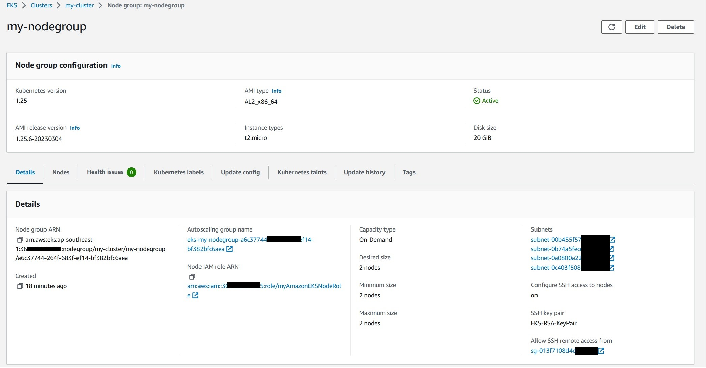
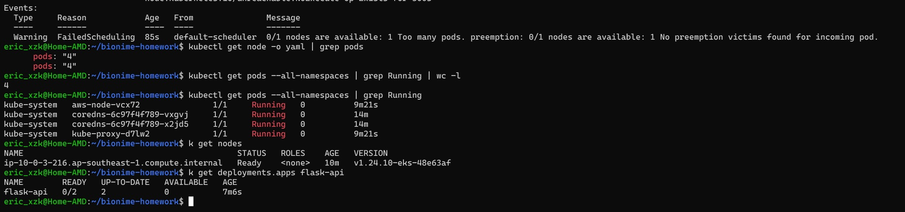

## 手動建立 AWS EKS service


在使用 Terraform 建立以前，先熟悉手動方式會比較合適。 我這邊參考 AWS 官方文件 [Getting started with Amazon EKS – AWS Management Console and AWS CLI](https://docs.aws.amazon.com/eks/latest/userguide/getting-started-console.html#eks-launch-workers)


1. 使用 `aws` CLI 工具建立 EKS 需要的 VPC，其中 `--region` 與 `--stack-name` 請自行更換。
註: 不想安裝 `aws` CLI tool 的話也能從網頁點啦~

```bash
aws cloudformation create-stack \
  --region ap-southeast-1 \
  --stack-name my-eks-vpc-stack \
  --template-url https://s3.us-west-2.amazonaws.com/amazon-eks/cloudformation/2020-10-29/amazon-eks-vpc-private-subnets.yaml
```


▲ 關於 EKS 使用的 VPC 搭配架構圖會比較好理解。圖片來源 [aws-quickstart / quickstart-amazon-eks ](https://github.com/aws-quickstart/quickstart-amazon-eks)


▲ CloudFomation stack 建立中


▲ 建議把這三個 AWS managed 的 role 都先拉出來

> - AWSServiceRoleForAmazonEKS：此 IAM role 是 Amazon EKS 服務的服務角色，可以用來控制 Amazon EKS 服務管理的 AWS 資源和 API 操作的權限。此角色是由 Amazon EKS 管理的，您不需要自己創建。
> - AWSServiceRoleForAmazonEKSNodegroup：此 IAM role 是用來授予 Amazon EKS worker node 的權限，以便它們能夠與 Amazon EKS API 進行通訊。當您向 Amazon EKS 中添加新的 worker node 時，可以指定此角色作為 worker node 的 IAM role。
> - eksClusterRole：此 IAM role 可以用來管理 Amazon EKS 群集。您可以使用此 IAM role 來設置群集的叢集層級 IAM 權限。此角色不是由 Amazon EKS 管理的，您需要自己創建此 IAM role。例如，您可以使用此 IAM role 設定叢集的存取控制原則，以便只有授權的使用者才能管理叢集，包括檢視叢集和管理與叢集關聯的 AWS 資源。


簡而言之，AWSServiceRoleForAmazonEKS 是 Amazon EKS 服務角色，AWSServiceRoleForAmazonEKSNodegroup 是 worker node 的 IAM role，而 eksClusterRole 則是群集的 IAM role，用於管理和設定 Amazon EKS 群集的存取控制原則。

(以上感謝 ChatGPT)


▲ 創建一個 role for EKS


2. 建立 Worker Node


▲ 建立 EKS managed worker node group。(註: `myAmazonEKSNodeRole` 是 attach `node-role-trust-policy` 這個 policy)


▲ 這邊可以選擇 EC2 instance type，如果想要省錢可以把 on-demand 改成 spot instance (但面臨競價)


▲ 設定 worker node desired 節點數量、最高離線節點數量 (worker node 升級會需要 drain 掉)


▲ VPC subnet 這邊選擇由先前 Cloudfomation stack 建立的四個


▲ config SSH access to nodes 打開後會跳警告


▲ 設定 SSH keypair、sg 等




▲ worker node group 建立後


3. 更新 `kubeconfig`

`AWS` 指令有提供更新 kubeconfig 的功能

```bash
aws eks update-kubeconfig --region ap-southeast-1 --name my-cluster
```


▲ 更新後還會自動切換 current cluster，真不錯~


▲ 透過 `kubectl get nodes` 確認旗下 worker node 是否正常


## 使用 Terraform 建立 EKS


參考 [hashicorp/learn-terraform-provision-eks-cluster ](https://github.com/hashicorp/learn-terraform-provision-eks-cluster) 產生。


- 建出來的 EC2 沒有 public IP 可以 SSH，以官方建議 EKS managed 的 worker node 來說也不建議開啟 SSH 權限，所以就把相關 IaC 程式碼移除。需要的可以參考 [terraform-aws-eks/examples/eks_managed_node_group/main.tf ](https://github.com/terraform-aws-modules/terraform-aws-eks/blob/v19.10.1/examples/eks_managed_node_group/main.tf)


```yaml
      remote_access = {
        ec2_ssh_key               = module.key_pair.key_pair_name
        source_security_group_ids = [aws_security_group.remote_access.id]
      }
```


▲ EKS managed worker node (EC2) 只有 private IP (我配置的關係) **如果有需要的話可以手動 attach 一個 Elastic IP、新增 security group 放行 SSH 訪問權限**


- 收費項目: EKS cluster、KMS key (Terraform 找不到可以關的選項)、VPC NAT Gateway (如果不開的話 EC2 沒辦法 join cluster)


▲ 上圖證明 EKS cluster 擁有網路連外 (internet) 權限，能夠 pull image。


### minikube demo


**<span style='color:blue'>由於 EKS 限制 `t2.micro` 只能跑 4 個 pods 光是 K8s 系統本身就額滿，為了不讓帳單爆炸，我使用 `minikube` 來驗證 `flask-api-deployment.yaml` 與 `lb-service-flask-api.yaml` 是否可以使用。</span>**




▲ EKS 限制 `t2.micro` 只能跑 4 個 pods。[AWS EKS 0/1 nodes are available. 1 insufficient pods](https://stackoverflow.com/questions/58987840/aws-eks-0-1-nodes-are-available-1-insufficient-pods)


如果 `service` type 使用 LoadBalance，則需先下 `minikube tunnel` 才能拿到 external IP。參考 [Accessing apps](https://minikube.sigs.k8s.io/docs/handbook/accessing/)


▲ 使用 `minikube` 測試兩個 YAML file 沒有問題


## Flask API server 使用說明


這次使用最簡單的範例，只能以 `GET` 方式獲取相同資訊

1. `/` 顯示 Hello World 靜態文字。
2. `/bio` 顯示公司首頁超連結


如果需要進階範例請參考: [flask-restful](https://github.com/flask-restful/flask-restful/tree/master/examples)


## 參考資料


- [How to Deploy a Flask Application to a Kubernetes Cluster](https://sweetcode.io/how-to-deploy-a-flask-application-to-a-kubernetes-cluster/)
- [關於 docker 出現 denied: requested access to the resource is denied 解決方式](https://israynotarray.com/docker/20220423/196903828/)
- [我的第一支 Terraform](https://blog.xxzk.me/post/20210922-terraform-hello-world/)
- [hashicorp/learn-terraform-provision-eks-cluster ](https://github.com/hashicorp/learn-terraform-provision-eks-cluster)
- [[minikube] CKA Note Section 10 Design and Install a Kubernetes Cluster - 老柯的學習筆記](https://blog.xxzk.me/post/20220719-cka_note_section_10_design_and_install_a_kubernetes_cluster/#%E6%88%91%E7%9A%84-minikube)
